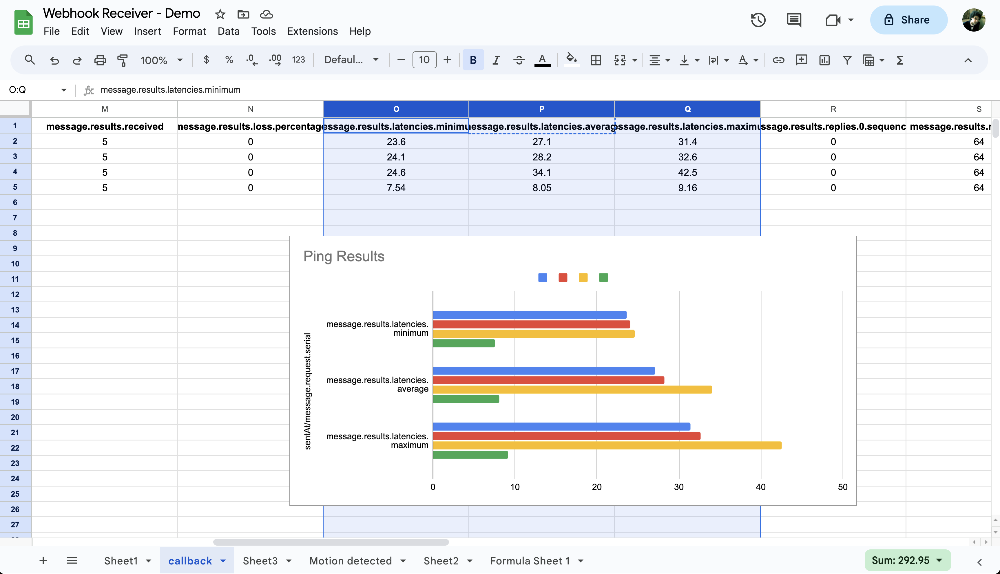

# Google Sheets Webhook Receiver for Meraki Alerts

## Overview

This Google Sheets script is designed to act as a webhook receiver for Meraki alerts and callbacks. When set up, it captures data sent by Meraki systems and formats this information within a Google Sheet. This setup is ideal for network administrators and IT professionals who use Meraki products and want an easy way to log and analyze alerts and callback data.

## Features

- **Webhook Receiver**: Captures Meraki alerts and callback data sent to the Google Sheets app.
- **Data Formatting**: Flattens JSON objects from Meraki for easier spreadsheet use.
- **Dynamic Header Creation**: Automatically creates and updates sheet headers based on incoming data keys.
- **Time Formatting**: Converts specific timestamp keys to UTC format.
- **Error Handling**: Adds extra columns to the sheet if the data contains more keys than the existing columns to prevent out of bounds errors.
- **Test Functions**: Includes test functions for alert and callback data to ensure proper setup and functionality.

## Setup Instructions

1. **Google Sheets Script Setup**:
   - Open a new Google Sheet.
   - Go to Extensions > Apps Script.
   - Copy the provided code into the Code.gs file.
   - Save the script.

2. **Publishing the App**:
   - In the Apps Script editor, click on 'Deploy' > 'New Deployment'.
   - Choose 'Execute as You' and set 'Who has access' to 'Anyone (including anonymous)'.
   - Click 'Deploy' and authorize the app when prompted.

3. **Obtaining Webhook URL**:
   - After deployment, a URL will be generated. This will act as your Webhook URL.
   - Copy this URL.

4. **Meraki Dashboard Configuration**:
   - Log into your Meraki Dashboard.
   - Navigate to the 'Alerts & Administration' section.
   - In the 'Webhooks' section, add a new webhook with the URL obtained from the Apps Script.

5. **Testing**:
   - Use the `testAlert()` and `testCallback()` functions in the script to simulate alert and callback data.

## Usage

- When Meraki sends an alert or callback to the provided Webhook URL, the script will automatically process and display this data in the Google Sheet.
- The script will create a new sheet for each alert type and format the data with appropriate headers.

## Best Practices

- Regularly monitor and maintain the Google Sheet for optimal performance.
- Ensure that your Meraki dashboard is correctly configured to send data to the Google Sheets webhook.
- Review the data periodically to ensure it's being captured and formatted correctly.

## Troubleshooting

- If data is not appearing in the sheet, check the webhook configuration in your Meraki dashboard.
- Ensure that the script is properly deployed and accessible.
- Verify that the Meraki system is correctly sending alerts and callbacks.

For more detailed guidance on the Cisco Meraki Dashboard API, webhooks, and related services, please refer to the Meraki OpenAPI specification and official documentation.

[Meraki.io](https://meraki.io)